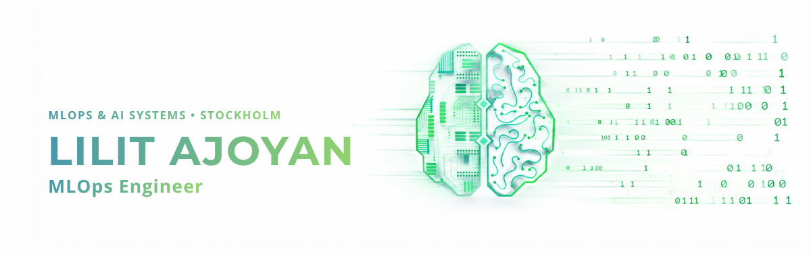

<picture>
  <source media="(prefers-color-scheme: dark)" srcset="banner_dark.png">
  <source media="(prefers-color-scheme: light)" srcset="LAJOYAN_light1.png">
  
</picture>

  

  <a href="https://github.com/LAjoyan/Portfolio-LAjoyan">
    <picture>
      <source media="(prefers-color-scheme: dark)" srcset="https://img.shields.io/badge/READ_FULL_PORTFOLIO-%2305080c?style=for-the-badge&logo=github&logoColor=white&color=%230d1117">
      <source media="(prefers-color-scheme: light)" srcset="https://img.shields.io/badge/READ_FULL_PORTFOLIO-2EA043?style=for-the-badge&logo=github&logoColor=white">
      
    </picture>
  </a>

  <picture>
    <source media="(prefers-color-scheme: dark)" srcset="https://img.shields.io/badge/Python-21262D?style=flat-square&logo=python&logoColor=white">
    <source media="(prefers-color-scheme: light)" srcset="https://img.shields.io/badge/Python-3776AB?style=flat-square&logo=python&logoColor=white">
    
  </picture>
  <picture>
    <source media="(prefers-color-scheme: dark)" srcset="https://img.shields.io/badge/Bash-21262D?style=flat-square&logo=gnu-bash&logoColor=white">
    <source media="(prefers-color-scheme: light)" srcset="https://img.shields.io/badge/Bash-4EAA25?style=flat-square&logo=gnu-bash&logoColor=white">
    
  </picture>
  <picture>
    <source media="(prefers-color-scheme: dark)" srcset="https://img.shields.io/badge/Linux-21262D?style=flat-square&logo=linux&logoColor=white">
    <source media="(prefers-color-scheme: light)" srcset="https://img.shields.io/badge/Linux-FCC624?style=flat-square&logo=linux&logoColor=black">
    
  </picture>
  <picture>
    <source media="(prefers-color-scheme: dark)" srcset="https://img.shields.io/badge/Git-21262D?style=flat-square&logo=git&logoColor=white">
    <source media="(prefers-color-scheme: light)" srcset="https://img.shields.io/badge/Git-F05032?style=flat-square&logo=git&logoColor=white">
    
  </picture>
  <picture>
    <source media="(prefers-color-scheme: dark)" srcset="https://img.shields.io/badge/PyTorch-21262D?style=flat-square&logo=pytorch&logoColor=white">
    <source media="(prefers-color-scheme: light)" srcset="https://img.shields.io/badge/PyTorch-EE4C2C?style=flat-square&logo=pytorch&logoColor=white">
    
  </picture>
  <picture>
    <source media="(prefers-color-scheme: dark)" srcset="https://img.shields.io/badge/Scikit--Learn-21262D?style=flat-square&logo=scikit-learn&logoColor=white">
    <source media="(prefers-color-scheme: light)" srcset="https://img.shields.io/badge/Scikit--Learn-F7931E?style=flat-square&logo=scikit-learn&logoColor=white">
    
  </picture>
  <picture>
    <source media="(prefers-color-scheme: dark)" srcset="https://img.shields.io/badge/Pandas-21262D?style=flat-square&logo=pandas&logoColor=white">
    <source media="(prefers-color-scheme: light)" srcset="https://img.shields.io/badge/Pandas-150458?style=flat-square&logo=pandas&logoColor=white">
    
  </picture>
  <picture>
    <source media="(prefers-color-scheme: dark)" srcset="https://img.shields.io/badge/DuckDB-21262D?style=flat-square&logo=duckdb&logoColor=white">
    <source media="(prefers-color-scheme: light)" srcset="https://img.shields.io/badge/DuckDB-FFF000?style=flat-square&logo=duckdb&logoColor=black">
    
  </picture>
  <picture>
    <source media="(prefers-color-scheme: dark)" srcset="https://img.shields.io/badge/TimescaleDB-21262D?style=flat-square&logo=timescale&logoColor=white">
    <source media="(prefers-color-scheme: light)" srcset="https://img.shields.io/badge/TimescaleDB-FDB515?style=flat-square&logo=timescale&logoColor=black">
    
  </picture>
  <picture>
    <source media="(prefers-color-scheme: dark)" srcset="https://img.shields.io/badge/GitHub_Actions-21262D?style=flat-square&logo=githubactions&logoColor=white">
    <source media="(prefers-color-scheme: light)" srcset="https://img.shields.io/badge/GitHub_Actions-2088FF?style=flat-square&logo=githubactions&logoColor=white">
    
  </picture>
  <picture>
    <source media="(prefers-color-scheme: dark)" srcset="https://img.shields.io/badge/CI%2FCD-21262D?style=flat-square&logo=git&logoColor=white">
    <source media="(prefers-color-scheme: light)" srcset="https://img.shields.io/badge/CI%2FCD-F05032?style=flat-square&logo=git&logoColor=white">
    
  </picture>
  <picture>
    <source media="(prefers-color-scheme: dark)" srcset="https://img.shields.io/badge/Docker-21262D?style=flat-square&logo=docker&logoColor=white">
    <source media="(prefers-color-scheme: light)" srcset="https://img.shields.io/badge/Docker-2496ED?style=flat-square&logo=docker&logoColor=white">
    
  </picture>
  <picture>
    <source media="(prefers-color-scheme: dark)" srcset="https://img.shields.io/badge/MLflow-21262D?style=flat-square&logo=mlflow&logoColor=white">
    <source media="(prefers-color-scheme: light)" srcset="https://img.shields.io/badge/MLflow-0194E2?style=flat-square&logo=mlflow&logoColor=white">
    
  </picture>
  <picture>
    <source media="(prefers-color-scheme: dark)" srcset="https://img.shields.io/badge/FastAPI-21262D?style=flat-square&logo=fastapi&logoColor=white">
    <source media="(prefers-color-scheme: light)" srcset="https://img.shields.io/badge/FastAPI-009688?style=flat-square&logo=fastapi&logoColor=white">
    
  </picture>
  <picture>
    <source media="(prefers-color-scheme: dark)" srcset="https://img.shields.io/badge/Azure-21262D?style=flat-square&logo=microsoftazure&logoColor=white">
    <source media="(prefers-color-scheme: light)" srcset="https://img.shields.io/badge/Azure-0089D6?style=flat-square&logo=microsoftazure&logoColor=white">
    
  </picture>
  <picture>
    <source media="(prefers-color-scheme: dark)" srcset="https://img.shields.io/badge/AWS-21262D?style=flat-square&logo=amazonwebservices&logoColor=white">
    <source media="(prefers-color-scheme: light)" srcset="https://img.shields.io/badge/AWS-232F3E?style=flat-square&logo=amazonwebservices&logoColor=white">
    
  </picture>
  <picture>
    <source media="(prefers-color-scheme: dark)" srcset="https://img.shields.io/badge/Raspberry_Pi-21262D?style=flat-square&logo=raspberrypi&logoColor=white">
    <source media="(prefers-color-scheme: light)" srcset="https://img.shields.io/badge/Raspberry_Pi-A22846?style=flat-square&logo=raspberrypi&logoColor=white">
    
  </picture>
  <picture>
    <source media="(prefers-color-scheme: dark)" srcset="https://img.shields.io/badge/MQTT-21262D?style=flat-square&logo=mqtt&logoColor=white">
    <source media="(prefers-color-scheme: light)" srcset="https://img.shields.io/badge/MQTT-660066?style=flat-square&logo=mqtt&logoColor=white">
    
  </picture>
  <picture>
    <source media="(prefers-color-scheme: dark)" srcset="https://img.shields.io/badge/Grafana-21262D?style=flat-square&logo=grafana&logoColor=white">
    <source media="(prefers-color-scheme: light)" srcset="https://img.shields.io/badge/Grafana-F46800?style=flat-square&logo=grafana&logoColor=white">
    
  </picture>
  <picture>
    <source media="(prefers-color-scheme: dark)" srcset="https://img.shields.io/badge/Streamlit-21262D?style=flat-square&logo=streamlit&logoColor=white">
    <source media="(prefers-color-scheme: light)" srcset="https://img.shields.io/badge/Streamlit-FF4B4B?style=flat-square&logo=streamlit&logoColor=white">
    
  </picture>
  <picture>
    <source media="(prefers-color-scheme: dark)" srcset="https://img.shields.io/badge/Evidence_BI-21262D?style=flat-square&logo=data&logoColor=white">
    <source media="(prefers-color-scheme: light)" srcset="https://img.shields.io/badge/Evidence_BI-3B82F6?style=flat-square&logo=data&logoColor=white">
    
  </picture>

